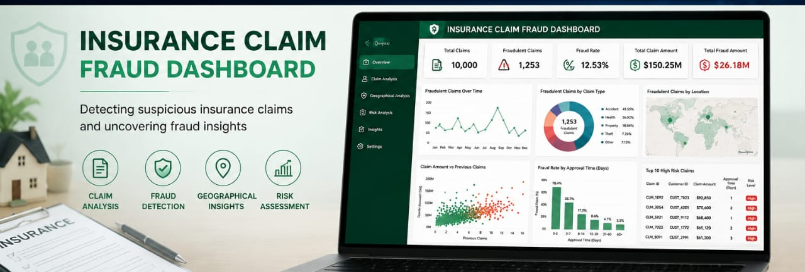
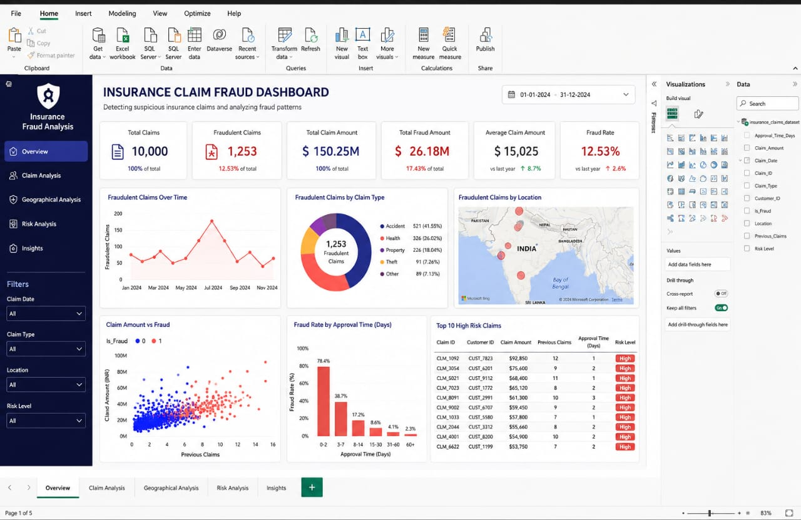

# Insurance Claim Fraud Dashboard

-Detecting suspicious insurance claims and uncovering fraud insights — a full-featured Power BI analytics solution for insurance fraud detection, risk assessment, and claims intelligence.

---

## Table of Contents

- [Introduction](#introduction)
- [Project Background](#project-background)
- [Dashboard Overview](#dashboard-overview)
- [Key Metrics](#key-metrics)
- [Dashboard Pages](#dashboard-pages)
- [Features](#features)
- [Dataset](#dataset)
- [Tech Stack](#tech-stack)
- [Getting Started](#getting-started)
- [Installation](#installation)
- [Usage](#usage)
- [Filters and Interactivity](#filters-and-interactivity)
- [Insights and Findings](#insights-and-findings)
- [Folder Structure](#folder-structure)
- [Contributing](#contributing)
- [Contact](#contact)

---

## Introduction

Insurance fraud is one of the most significant challenges facing the global insurance industry. It results in billions of dollars in losses every year, drives up premiums for honest policyholders, and strains operational resources for insurers. Identifying fraudulent claims early and accurately is critical to protecting both the business and its customers.

The *Insurance Claim Fraud Dashboard* is an end-to-end business intelligence solution built with Power BI that enables fraud analysts, risk managers, and insurance operations teams to:

- Monitor claim activity across a full calendar year
- Identify patterns and anomalies that indicate fraud
- Assess risk levels across customer segments and claim types
- Prioritize high-risk cases for investigation
- Track fraud trends over time to inform policy decisions

This dashboard transforms raw claims data into clear, actionable visual intelligence — reducing the time it takes to detect fraud and enabling data-driven decision-making at every level of the organization.

---

## Project Background

This project was developed to address a growing need for a centralized, visual analytics tool that consolidates insurance claims data and surfaces fraud signals across multiple dimensions — including claim type, geography, approval time, and customer history.

The dashboard covers a full calendar year of claims data (January 2024 – December 2024) across 10,000 insurance claims, of which 1,253 were identified as fraudulent — representing a fraud rate of 12.53%.

The goal was not just to visualize data, but to build an intelligent tool that helps teams ask better questions: Which claim types are most vulnerable? Where geographically is fraud concentrated? Does approval speed correlate with fraud likelihood? Who are the highest-risk customers?

---

## Dashboard Overview

The dashboard is organized into 5 pages, each designed to answer a specific set of business questions:

| Page                  | Purpose                                              |
|-----------------------|------------------------------------------------------|
| Overview              | High-level KPIs and summary charts                   |
| Claim Analysis        | Deep dive into claims by type, amount, and fraud status |
| Geographical Analysis | Location-based fraud distribution map                |
| Risk Analysis         | Approval time vs. fraud rate and risk scoring        |
| Insights              | Key findings, patterns, and recommendations          |

---

## Key Metrics

| Metric                | Value      |
|-----------------------|------------|
| Total Claims          | 10,000     |
| Fraudulent Claims     | 1,253      |
| Fraud Rate            | 12.53%     |
| Total Claim Amount    | $150.25M   |
| Total Fraud Amount    | $26.18M    |
| Average Claim Amount  | $15,025    |

All KPI cards update dynamically based on the filters applied (date range, claim type, location, risk level).

---

## Dashboard Pages

### 1. Overview

The landing page provides a bird's-eye view of the entire claims portfolio. Key components include:

- *KPI Cards* — Total Claims, Fraudulent Claims, Total Claim Amount, Total Fraud Amount, Average Claim Amount, and Fraud Rate, each with year-over-year comparisons.
- *Fraudulent Claims Over Time* — A line chart tracking monthly fraudulent claim counts from January to December 2024, revealing seasonal spikes and trends.
- *Fraudulent Claims by Claim Type* — A donut chart showing the breakdown of fraud across five categories:
  - Accident: 41.55%
  - Health: 26.02%
  - Property: 18.04%
  - Theft: 7.26%
  - Other: 7.13%
- *Fraudulent Claims by Location* — An interactive map powered by Microsoft Bing Maps showing geographic hotspots for fraudulent activity.
- *Top 10 High-Risk Claims* — A ranked table of the most suspicious claims by claim amount, approval time, and risk level.

### 2. Claim Analysis

A detailed breakdown of claims across multiple dimensions:

- *Claim Amount vs. Fraud* — A scatter plot comparing claim amounts against previous claims history, color-coded by fraud status (0 = legitimate, 1 = fraudulent). Higher previous claim counts correlate strongly with fraudulent behavior.
- *Claims by Type* — Bar and pie charts showing volume and value distribution across claim categories.
- *Fraud Rate by Claim Type* — Highlights which claim categories carry the highest fraud risk.
- *Monthly Trends* — Line chart showing both total and fraudulent claim volumes month by month.

### 3. Geographical Analysis

A location intelligence view of fraud distribution:

- *Interactive Map* — Plots fraudulent claim density by region using bubble overlays. Users can zoom, pan, and click regions for detail.
- *Top Fraud Locations* — A ranked list of geographic areas with the highest fraud incidence.
- *Location Filter* — Allows filtering the entire report by specific regions.

### 4. Risk Analysis

Focused on understanding the relationship between operational variables and fraud:

- *Fraud Rate by Approval Time (Days)* — A bar chart showing how fraud rates vary across approval time windows:
  - 0–2 days: 78.4% fraud rate
  - 3–7 days: 38.7%
  - 8–14 days: 17.2%
  - 15–30 days: 8.6%
  - 31–60 days: 4.1%
  - 60+ days: 2.3%
- *Risk Level Distribution* — Breakdown of claims flagged as High, Medium, or Low risk.
- *High-Risk Claim Table* — Full list of high-risk claims with Customer ID, Claim Amount, Previous Claims, Approval Time, and Risk Level.

### 5. Insights

A narrative summary page that consolidates key findings and patterns discovered through the analysis, including recommended actions for fraud prevention teams.

---

## Features

- Real-time KPI monitoring with dynamic cards
- Interactive filters for date range, claim type, location, and risk level
- Drill-through enabled on claim and customer records
- Cross-report filtering — selecting a chart element filters all other visuals on the page
- Geographical heatmap powered by Bing Maps
- Scatter plot analysis for fraud vs. claim amount correlation
- Approval time fraud rate analysis revealing process vulnerabilities
- Top 10 high-risk claims table with sortable columns
- Year-over-year comparisons on key metrics
- 5 dedicated report pages covering the full fraud analytics lifecycle

---

## Dataset

The dashboard is powered by a single primary dataset: insurance_claims_dataset

### Fields

| Field               | Type    | Description                                          |
|---------------------|---------|------------------------------------------------------|
| Claim_ID            | Text    | Unique identifier for each claim (e.g. CLM_1092)    |
| Customer_ID         | Text    | Unique customer identifier (e.g. CUST_7823)         |
| Claim_Date          | Date    | Date the claim was submitted                         |
| Claim_Type          | Text    | Accident, Health, Property, Theft, or Other          |
| Claim_Amount        | Decimal | Value of the claim in USD                            |
| Is_Fraud            | Boolean | 1 = Fraudulent, 0 = Legitimate                       |
| Location            | Text    | Geographic region or city                            |
| Risk_Level          | Text    | High / Medium / Low                                  |
| Previous_Claims     | Integer | Number of prior claims by the same customer          |
| Approval_Time_Days  | Integer | Number of days taken to approve the claim            |

*Notes:*
- Dataset covers January 1, 2024 – December 31, 2024
- Total records: 10,000 claims
- No personally identifiable information (PII) is included beyond anonymized Customer IDs
- For production use, connect to your live data source or data warehouse

---

## Tech Stack

| Tool                        | Purpose                                    |
|-----------------------------|--------------------------------------------|
| Power BI Desktop            | Dashboard development and data modeling    |
| DAX (Data Analysis Expressions) | Custom measures and calculated columns |
| Power Query (M Language)    | Data transformation and cleaning           |
| Microsoft Bing Maps         | Geographical fraud visualization           |
| Excel / CSV                 | Source data format                         |

---

## Getting Started

### Prerequisites

Before you begin, ensure you have the following installed:

- [Power BI Desktop](https://powerbi.microsoft.com/en-us/desktop/) — free download from Microsoft
- Git — for cloning the repository
- Microsoft account — required to use Bing Maps visual in Power BI

---

## Installation

1. Clone the repository

bash
git clone https://github.com/YOUR_USERNAME/insurance-claim-fraud-dashboard.git

2. Navigate into the project folder

bash
cd insurance-claim-fraud-dashboard

3. Open the Power BI file

Double-click InsuranceClaimFraudDashboard.pbix to open it in Power BI Desktop.

4. Connect your data source

If using the included sample dataset, Power BI will load it automatically. To connect your own data, go to:

Home > Transform Data > Data Source Settings

5. Refresh the data

Home > Refresh

---

## Usage

Once the dashboard is open in Power BI Desktop:

1. Navigate pages using the tabs at the bottom: Overview > Claim Analysis > Geographical Analysis > Risk Analysis > Insights.
2. Apply filters using the filter panel on the left side (Claim Date, Claim Type, Location, Risk Level).
3. Cross-filter by clicking any chart element — all other visuals on the page will update accordingly.
4. Drill through to a specific claim or customer by right-clicking a data point and selecting "Drill through."
5. Export visuals or data using the "..." menu on any visual > Export data.

To publish to Power BI Service:

Home > Publish > Select your workspace

---

## Filters and Interactivity

| Filter      | Options                                              |
|-------------|------------------------------------------------------|
| Claim Date  | Custom date range (default: 01-01-2024 to 31-12-2024) |
| Claim Type  | All / Accident / Health / Property / Theft / Other   |
| Location    | All / Individual regions                             |
| Risk Level  | All / High / Medium / Low                            |

All filters are synced across the Overview, Claim Analysis, and Risk Analysis pages.

---

## Insights and Findings

Key insights surfaced by this dashboard:

1. *Fast approvals are a red flag.* Claims approved in 0–2 days have a fraud rate of 78.4% — nearly 8 in 10. This is the single strongest predictor of fraud in the dataset and suggests that fraudsters are exploiting expedited processing pathways. Introducing a mandatory secondary review for same-day approvals is strongly recommended.

2. *Accident claims dominate fraud volume.* At 41.55% of all fraudulent claims, accident claims are the most commonly abused category — likely due to the difficulty of verification and the high claim amounts involved. Additional documentation requirements for accident claims could reduce exposure.

3. *Repeat claimants are high-risk.* Customers with a higher number of previous claims show a disproportionately high rate of fraud, as shown clearly in the Claim Amount vs. Fraud scatter plot. Customers with 10+ previous claims warrant enhanced due diligence on any new submission.

4. *Geographic clustering points to organized fraud.* The map visualization reveals that fraudulent claims are not evenly distributed — certain regions show dense clusters, suggesting coordinated or organized fraud activity that warrants targeted, region-specific investigation.

5. *$26.18M in fraud exposure.* Out of $150.25M in total claims, over $26M is attributable to fraudulent activity — representing 17.43% of total claim value. Addressing the top three risk factors above (approval speed, accident claims, repeat claimants) could significantly reduce this exposure.

---
## Folder Structure

insurance-claim-fraud-dashboard/
│

├── InsuranceClaimFraudDashboard.pbix   # Main Power BI dashboard file
├── data/

│   └── insurance_claims_dataset.csv    # Sample dataset
├── assets/

│   └── preview.png                     # Dashboard screenshot

├── README.md                           # Project documentation

---

## Contributing

Contributions are welcome. If you would like to improve this dashboard — whether by adding new visuals, refining DAX measures, or expanding the dataset — please follow these steps:

1. Fork the repository
2. Create a new branch: git checkout -b feature/your-feature-name
3. Commit your changes: git commit -m "Add: description of your change"
4. Push to the branch: git push origin feature/your-feature-name
5. Open a Pull Request

Please ensure your changes are well-documented and tested before submitting.

---

## Contact

*Author:* Ukatta Chinasa Rachael
*Email:* ukattachinasa@gmail.com
*LinkedIn:* https://linkedin.com/in/rachael-chinasa-1a47936a
*GitHub:* https://github.com/Rachael88699
